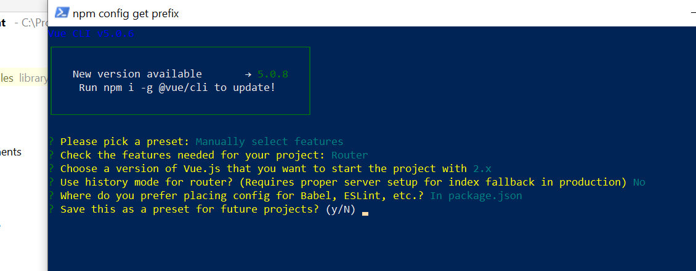
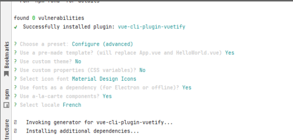
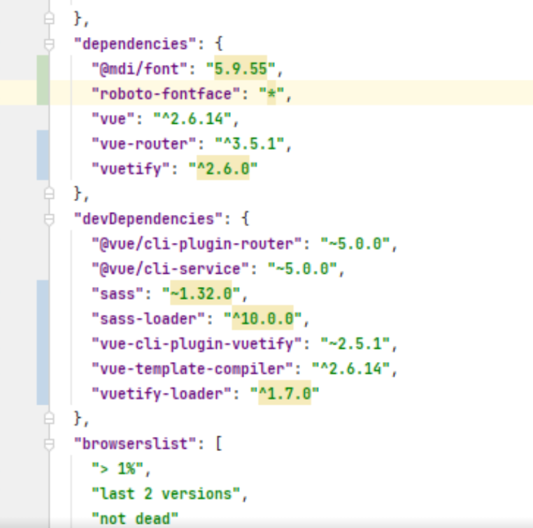

# Qualimarc

## Project setup
```
npm install
```

### Compiles and hot-reloads for development
```
npm run serve
```

### Compiles and minifies for production
```
npm run build
```

### Customize configuration
See [Configuration Reference](https://cli.vuejs.org/config/).

###Dependances vuetify

    "@mdi/font": "5.9.55",
    "roboto-fontface": "*",
    "vuetify": "^2.6.0"

    "sass": "~1.32.0",
    "sass-loader": "^10.0.0",
    "vuetify-loader": "^1.7.0"

###Update tilde et caret dans package.json

~version "Approximativement équivalent à la version" vous mettra à jour vers toutes les futures versions du patch, sans incrémenter la version mineure. ~1.2.3 utilisera les versions de 1.2.3 à <1.3.0.

^version "Compatible avec la version" vous mettra à jour vers toutes les futures versions mineures ou correctives, sans incrémenter la version majeure. ^2.3.4 utilisera les versions de 2.3.4 à <3.0.0.

###Choix à l'amorçage du projet faits avec vue-cli

vue create



vue add vuetify



package.json après



puis, npm install pinia


